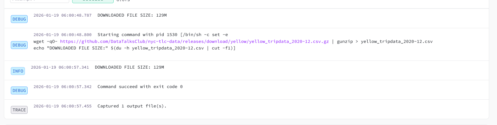
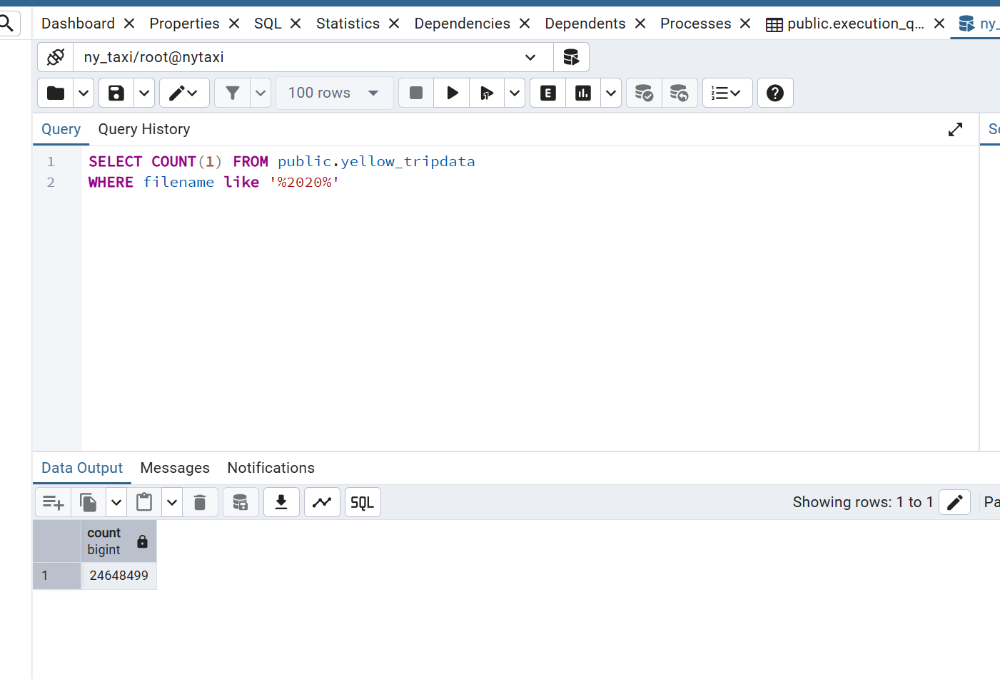
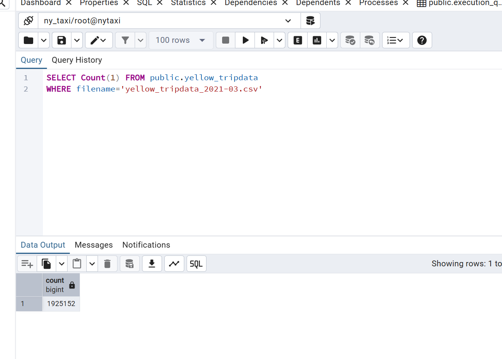

**Q1**

I have added a log message in line 30 of the Kestra workflow to record the file size, and based on the log message, the file size of yellow_tripdata_2020-12.csv is:

**Q2**

Based on the logs in Q1, the name for green tripdata, 2020-04 should follow the same format.

**Q3**

After executing backfills for yellow tripdata for 2020-01 - 2020-12, the row number is calculated on the connected postgres database:

**Q4**

Similar as Q3, the result is:

**Q5**

